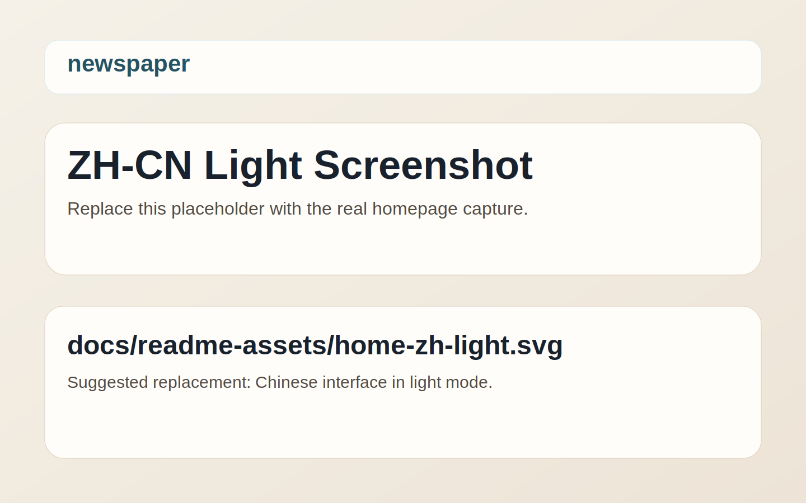
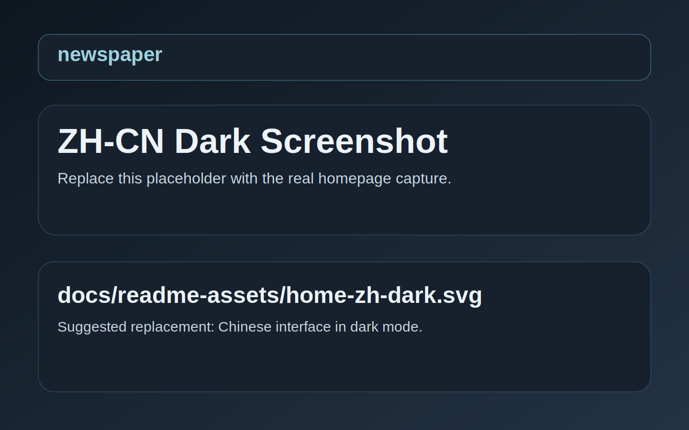
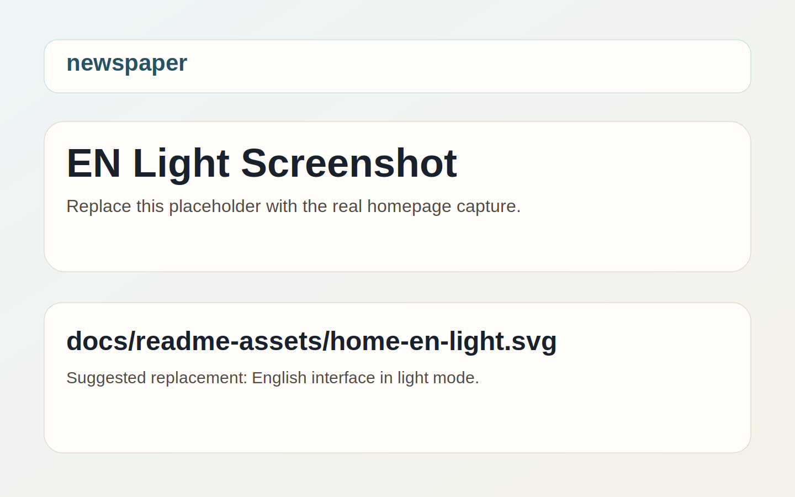
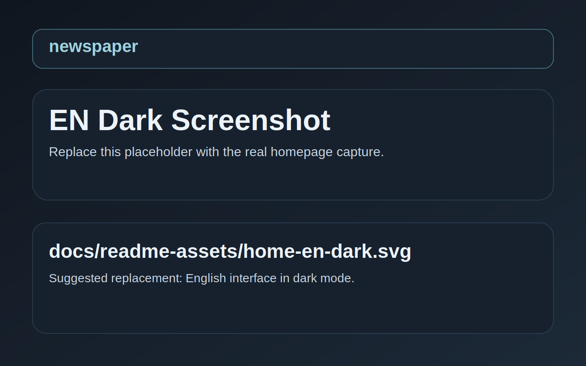

# newspaper

<p align="center">
  一个面向长期写作的双语 Astro 博客主题，强调稳定的信息架构、克制的客户端增强，以及接近纸媒排版的阅读体验。
</p>

<p align="center">
  <a href="./README.en.md">English</a> ·
  <a href="./docs/wiki/Home.md">Wiki</a> ·
  <a href="./docs/wiki/Home-en.md">Wiki (EN)</a>
</p>

## 特性概览

- 双语路由结构，默认 `zh-cn` 位于 `/`，英文位于 `/en/`
- 完整页面体系：首页、分页、归档、标签、搜索、关于、RSS、404、文章详情
- 基于 Astro Content Collections 的内容流，支持 Markdown / MDX
- 浅色 / 深色主题、搜索、代码复制、阅读进度、回到顶部、可选 Waline 评论
- 设计系统分层清晰，样式按 `tokens / base / layout / listing / article / responsive` 组织
- 站点配置集中在 `src/config/`，包括导航、首页信息区、Footer、媒体预设与交互参数
- 语义化元信息完善，覆盖 canonical、`hreflang`、RSS、Open Graph、Twitter Card 和结构化数据

## Screenshots

> 当前仓库已预留截图占位资源，后续可直接替换 `docs/readme-assets/` 中同名文件，或按需改为真实 PNG/JPG 路径。

| 界面 | Light Mode | Dark Mode |
| --- | --- | --- |
| 中文 |  |  |
| English |  |  |

## 快速开始

### 环境要求

- Node.js `>= 22.12.0`
- npm `>= 10`

### 安装

```bash
git clone https://github.com/mufengyian/astro-newspaper.git your-blog-name
cd your-blog-name
npm install
```

### 环境变量

复制 [`.env.example`](./.env.example) 为 `.env`：

```bash
cp .env.example .env
```

```bash
PUBLIC_SITE_URL="https://your-domain.com"
PUBLIC_WALINE_SERVER_URL="https://your-waline-server.vercel.app"
```

说明：

- `PUBLIC_SITE_URL` 用于 canonical、sitemap、RSS、Open Graph、Twitter Card、`hreflang` 与 `robots.txt`
- `PUBLIC_WALINE_SERVER_URL` 为可选项，未配置时文章页不会渲染评论区

### 本地开发与验证

```bash
npm run dev
npm run check
npm run build
```

## 配置入口

### `src/config/site.ts`

站点级配置总入口，包含：

- `navigationItems`：导航顺序
- `homeInfo.enabled`：首页 `home-info` 区块显示开关
- `footer`：版权、备案与外部链接
- `content`：首页数量、分页大小、相关文章数量
- `search`：搜索阈值、数量和元信息分隔符
- `comments`：Waline 默认配置
- `media`：封面图输出尺寸、格式与质量

### `src/config/about.ts`

关于页长文案与内容分区。

### `src/config/i18n/`

中英文词典与类型定义。新增主题 UI 文案时，建议先更新 `types.ts`，再同步两个 locale 文件。

### `src/styles/tokens.css`

主题视觉变量入口。颜色、间距、圆角、阴影、动画与列表卡片尺寸变量都统一收敛在这里。

### `astro.config.mjs`

Astro 基础设施配置，包括 i18n、prefetch、Markdown / MDX、Shiki 和图片服务。

## 内容模型

示例 frontmatter：

```yaml
---
title: Hello Astro
excerpt: 用一篇文章验证你的内容链路。
publishDate: 2026-04-01
locale: zh-cn
translationKey: hello-astro
tags:
  - astro
  - theme
cover: ../../assets/covers/paper-constellation.svg
coverAlt: Abstract paper constellation cover
---
```

常用字段说明：

- `locale`：当前文章所属语言
- `translationKey`：中英文文章映射键
- `excerpt`：列表摘要与 SEO 描述基础文案
- `cover` / `coverAlt`：文章封面资源与替代文本

## 项目结构

```text
src/
  assets/
  components/
    pages/
  config/
    i18n/
  content/
    posts/
  layouts/
  pages/
  scripts/
  styles/
  utils/
docs/
  readme-assets/
  wiki/
public/
astro.config.mjs
```

## 常用命令

| 命令 | 作用 |
| --- | --- |
| `npm run dev` | 启动本地开发 |
| `npm run check` | 运行 Astro 类型检查 |
| `npm run build` | 生成生产构建 |
| `npm run preview` | 预览生产构建 |
| `npm run sync` | 同步 Astro 生成类型 |

## 文档

- [Wiki 首页](./docs/wiki/Home.md)
- [快速开始](./docs/wiki/Quick-Start-zh-cn.md)
- [配置说明](./docs/wiki/Configuration-zh-cn.md)
- [内容与 MDX](./docs/wiki/Content-and-MDX-zh-cn.md)
- [图片与 astro:assets](./docs/wiki/Images-and-Assets-zh-cn.md)
- [i18n](./docs/wiki/i18n-zh-cn.md)
- [评论与部署](./docs/wiki/Comments-and-Deployment-zh-cn.md)
- [FAQ](./docs/wiki/FAQ-zh-cn.md)

## 致谢

灵感来自 [Paper](https://github.com/nanxiaobei/hugo-paper)、[PaperMod](https://github.com/adityatelange/hugo-PaperMod)、[astro-paper](https://github.com/satnaing/astro-paper) 与 [fuwari](https://github.com/saicaca/fuwari)。

## 许可

MIT，详见 [LICENSE](./LICENSE)。
